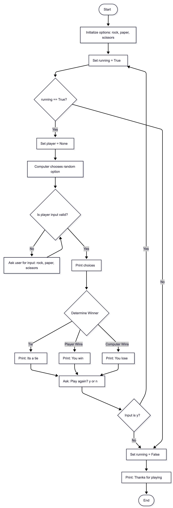

# Rock-Paper-Scissors_Python_Project
A simple and interactive Rock–Paper–Scissors game built using Python
Play against the computer, test your luck, and enjoy an easy-to-use console interface!
* By Kunal Yadav(1/24/SET/BCS/010) and Pankaj Singh(1/24/SET/BCS/012)
## How the Game Works

- The player chooses **rock**, **paper**, or **scissors**.
- The computer randomly selects one of the three options.
- The winner is decided using the classic rules:
  - **Rock** crushes **Scissors**
  - **Scissors** cut **Paper**
  - **Paper** covers **Rock**
- The result is displayed each round.
- The user can choose to play again or quit.

## Flowchart

